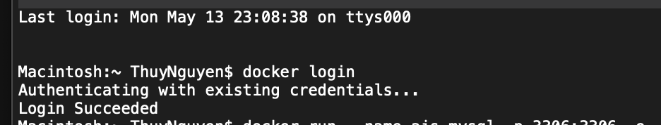
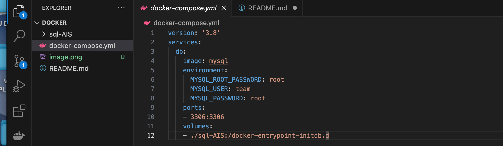
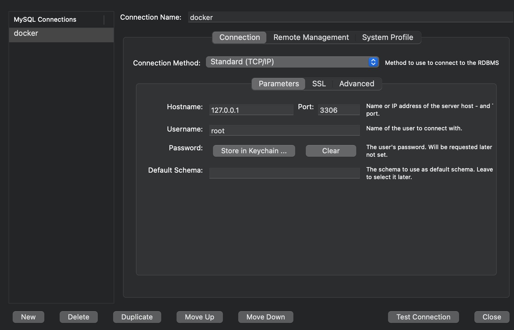

# Docker set-up guide
* Step 1: Create Docker account and Install docker desktop
* Step 2: Run Docker Desktop apps
* Step 3: Open Terminal and Login Docker from Terminal

* Step 4: In Visual Studio Code: Create and Open a new folder named "Docker", create an open a new file named " docker-compose.yml". Save the yml file. 

* Step 5: Download Mysql Workbench
* Step 6: Create a new folder inside folder "Docker"  called "sql-AIS", create sample query.sql in folder
* Step 7: Run docker-compose file using command: docker-compose -f docker-compose.yml up
* Step 8: Open Mysql Workbench and create a new connection

* Step 9: Test connection to check if its succeffully connected